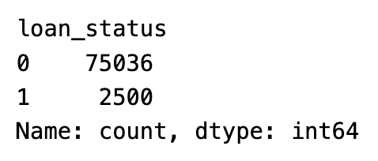
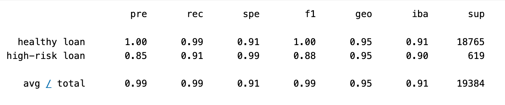
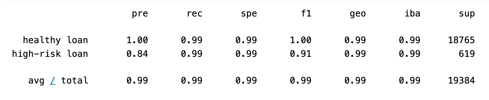

# Module 12 Challenge - Credit Risk Classification

## Overview of the Analysis

### Purpose of the analysis

The purpose of this analysis is to build a model, utilizing Logistic Regression, that can correctly identify the creditworthiness of borrowers based on a dataset of historical lending, i.e. `lending_data.csv`.

### Dataset

The dataset includes the following input features (X):
* loan_size
* interest_rate
* borrower_income
* debt_to_income
* num_of_accounts
* derogatory_marks
* total_debt

The output target (y) will be:
* loan_status

### Target Variable Counts

The `value_counts()` of the target, `loan_status` are shown in the following screenshot from the Jupyter notebook. 



Note: "0" denotes a healthy loan and "1" denotes a high-risk loan in the original dataset.

### Machine Learning Stages and Methods Used

The notebook [notebook](credit_risk_resampling.ipynb) loads the following libraries and dependencies.

```python
import numpy as np
import pandas as pd
from pathlib import Path
from sklearn.metrics import balanced_accuracy_score
from sklearn.metrics import confusion_matrix
from imblearn.metrics import classification_report_imbalanced
from sklearn.linear_model import LogisticRegression
from imblearn.over_sampling import RandomOverSampler

import warnings
warnings.filterwarnings('ignore')
```
After importing the dataset into a Pandas dataframe using `read_csv`, the columns were separated into the features (X) and the target (y) variables for further processing. 

The balance of `0`'s (healthy loans) and `1`'s (high-risk loans) of the `y` variable was checked utilizing the `value_counts` method. 

The dataset was split into `X_train`, `X_test`, `y_train`, and `y_test` variables utilizing `train_test_split`

#### Model 1 - Logistic Regression Model

The first of two models was a Logistic Regression model. First the model was instantiated using the `LogisticRegression` class from the `scikit-learn` library. 

Then the model was `.fit` to the training dataset. Predictions were run using `.predict` on the testing data. 

Next, a balanced accuracy report, confusion matrix, and classification report (`classification_report_imbalanced`) was generated for analysis and evaluation of the model. 

#### Model 2 - Logistic Regression Model with Resampled training data

The same process was followed as in Model 1, except that the data was resampled utilizing the `RandomOverSampler` class from the `imbalanced-learn` library prior to fitting the oversampled data, fitting it to the logistic regression model, making predictions, and generating evaluatory components for the analysis and comparison of the two model approaches. 

## Results

* Machine Learning Model 1:
  * Description: Logistic Regression
  * Balanced Accuracy Score: 95.2% (0.9520479254722232)
  * Healthy loan (0) <u>Precision</u>: 100% (1.00)
  * Healthy loan (0) <u>Recall</u>: 99% (0.99)
  * High-risk loan (1) <u>Precision</u>: 85% (0.85)
  * High-risk loan (1) <u>Recall</u>: 91% (0.91)

See screenshot below for additional classification report metrics for ML Model 1:




* Machine Learning Model 2:
  * Description: Logistic Regression w/ resampled training data
  * Balanced Accuracy Score: 95.2% (0.9936781215845847)
  * Healthy loan (0) <u>Precision</u>: 100% (1.00)
  * Healthy loan (0) <u>Recall</u>: 99% (0.99)
  * High-risk loan (1) <u>Precision</u>: 84% (0.84)
  * High-risk loan (1) <u>Recall</u>: 99% (0.99)

See screenshot below for additional classification report metrics for ML Model 2:




## Summary

In Model 1 there were 102 False Positives (FP) and 56 False Negatives (FN) in the data set. In Model 2 there were 116 FPs and 4 FNs. 

A FP is a record that was errantly labeled as a high-risk loan (1) but was not (0). This constitutes a loss of opportunity for the company to do business with what would likely have been a profitable loan with a creditworthy customer. 

A FN is a record that was errantly labeled as a healthy loan (0) but was not (1).  This constitutes a loan that would likely have ended in default to a less than creditworthy customer. 

An investment addage that is often cited is that if you lose 50% of your investment it then takes a 100% return to get back to baseline (where you started). It is because of this reality that I would recommend Model 2 over Model 1, with the understanding that it is possible that there is yet a better performing model that could be achieved with more research and fine tuning. 

Model 2 produces fewer FNs at 4 for this dataset, compared to 56 with Model 1. Avoiding loss is the primary goal of investing and loan defaults are far worse than loss of opportunity in this case. 

## Sources

The following sources were consulted in the completion of this project. 

* [pandas.Pydata.org API Reference](https://pandas.pydata.org/docs/reference/index.html)
* UCB FinTech Bootcamp instructor-led coding exercises